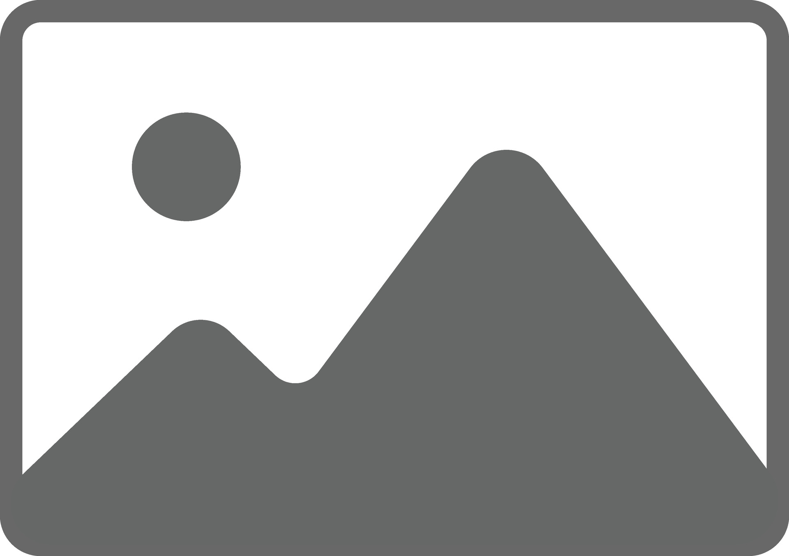

# SVG ICONS

| Icon                                       | Details        | Link                                                     |
|--------------------------------------------|----------------|----------------------------------------------------------|
|       | Back Icon      | [Svg Repo](http://svgrepo.com)                           |  
|    | Category Icon  | [Svg Repo](http://svgrepo.com)                           |  
|     | Delete Icon    | [Svg Repo](http://svgrepo.com)                           |  
|    | Details Icon   | [Svg Repo](http://svgrepo.com)                           |  
|       | Edit Icon      | [Svg Repo](http://svgrepo.com)                           |  
|      | Event Icon     | [Svg Repo](http://svgrepo.com)                           |  
|  | Organizer Icon | [Person Team](http://svgrepo.com/svg/484077/person-team) |  

# IMAGES

| Image                                           | Details           | Link                                                                                           |
|-------------------------------------------------|-------------------|------------------------------------------------------------------------------------------------|
|  | PlaceHolder Image | [Vectezzy.com](https://www.vecteezy.com/vector-art/48910778-default-image-missing-placeholder) |